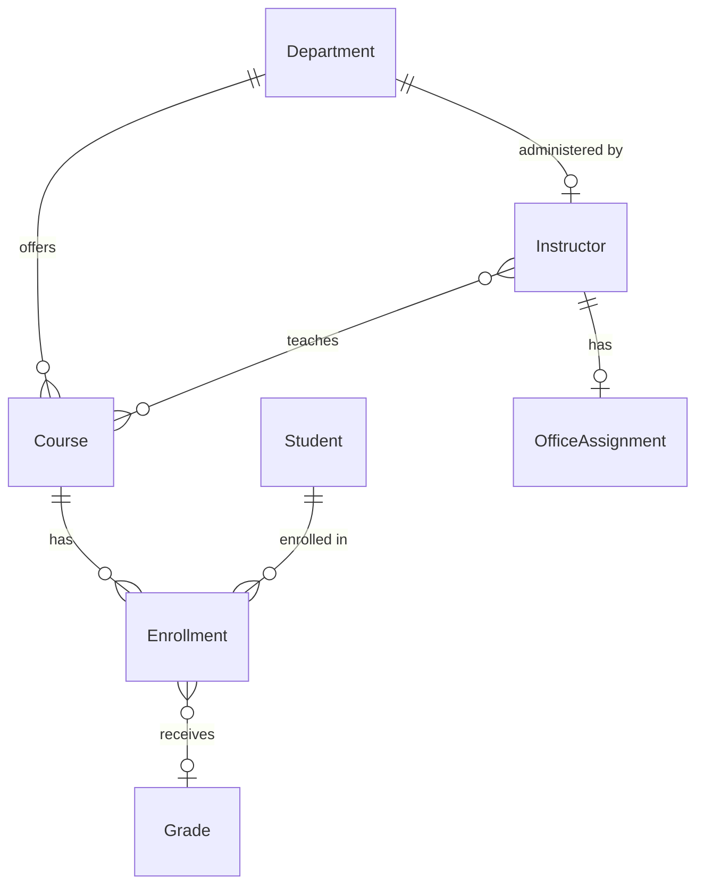

# ContosoUniversity — Python Edition

A Python Flask web application for the **Everything GitHub Copilot Hands-On Lab**. This is a university management system built with Flask, SQLAlchemy, and Jinja2 — designed for learners to explore GitHub Copilot agents, skills, prompts, hooks, MCP servers, and agentic workflows.

> **Note:** A .NET version of this application also exists in the repository root. Both versions are functionally equivalent and can be used interchangeably for the lab exercises.

## Quick Start

### Prerequisites

| Requirement | Details |
|-------------|---------|
| **Python 3.11+** | [Download](https://www.python.org/downloads/) — verify with `python --version` |
| **pip** | Included with Python — verify with `pip --version` |
| **Git** | [Install](https://git-scm.com/downloads) |
| **GitHub Copilot** | VS Code extension or Copilot CLI |

### 1. Install Dependencies

```bash
cd ContosoUniversity_Python
pip install -r requirements.txt
```

### 2. Run the Application

```bash
python run.py
```

The app starts at **http://localhost:5000**. On first run, the database is automatically created and seeded with sample data (students, courses, instructors, departments).

> **Note:** The development configuration uses SQLite (`contoso_university.db`), which is created automatically. No external database required.

### 3. Run Tests

```bash
python -m pytest tests/ -v
```

### 4. Verify Setup

| Check | Command | Expected |
|-------|---------|----------|
| Python version | `python --version` | 3.11+ |
| Dependencies | `pip install -r requirements.txt` | All installed |
| App runs | `python run.py` | Server at http://localhost:5000 |
| Tests pass | `python -m pytest tests/ -v` | 42 tests pass |
| Copilot CLI | `copilot --version` | Version number |

## The Application

**ContosoUniversity** models a university system with these entities:



### Features

- **Student Management** — CRUD with search, sorting, and pagination
- **Course Management** — CRUD with department assignment and file upload
- **Department Management** — CRUD with instructor administrator assignment
- **Instructor Management** — CRUD with office assignment and course checkboxes
- **Authentication** — Cookie-based with automatic dev login
- **Notifications** — Entity change tracking (create/update/delete)

## Project Structure

```
ContosoUniversity_Python/
├── config.py                 # Flask configuration (dev/test/prod)
├── run.py                    # Development server entry point
├── wsgi.py                   # Production WSGI entry point (gunicorn/waitress)
├── pyproject.toml            # Project metadata and tool config
├── requirements.txt          # Production dependencies
├── requirements-dev.txt      # Development dependencies
│
├── app/                      # Main application package
│   ├── __init__.py           # Flask app factory
│   ├── seed.py               # Database seed data
│   ├── models/               # SQLAlchemy domain models
│   │   ├── person.py         # Base class (single-table inheritance)
│   │   ├── student.py        # Student entity
│   │   ├── instructor.py     # Instructor entity
│   │   ├── course.py         # Course entity
│   │   ├── enrollment.py     # Enrollment + Grade enum
│   │   ├── department.py     # Department entity
│   │   ├── office_assignment.py
│   │   ├── course_assignment.py  # Many-to-many join
│   │   └── notification.py   # Change notifications
│   ├── routes/               # Flask blueprints (URL routing)
│   │   ├── home.py           # Home, About, Privacy
│   │   ├── students.py       # /students/ CRUD
│   │   ├── courses.py        # /courses/ CRUD
│   │   ├── departments.py    # /departments/ CRUD
│   │   ├── instructors.py    # /instructors/ CRUD
│   │   └── auth.py           # Sign in/out
│   ├── forms/                # WTForms validation
│   ├── services/             # Business logic
│   │   ├── student_query_service.py   # Search/sort/pagination
│   │   ├── notification_service.py    # Change notifications
│   │   └── file_storage_service.py    # File uploads
│   ├── repositories/         # Data access abstraction
│   ├── templates/            # Jinja2 HTML templates
│   ├── static/               # CSS, JS, uploads
│   └── utils/                # Utility functions
│
├── tests/                    # pytest test suite
│   ├── conftest.py           # Shared fixtures
│   ├── unit/                 # Model and enum tests
│   └── integration/          # Route and database tests
│
└── playwright_tests/         # E2E browser tests
```

## Technology Stack

| Component | Technology | Purpose |
|-----------|-----------|---------|
| **Web Framework** | Flask 3.0 | HTTP routing, templates, request handling |
| **ORM** | SQLAlchemy 2.0 | Database models with type-annotated `Mapped[]` columns |
| **Database** | SQLite (dev) | Zero-config local development |
| **Forms** | Flask-WTF / WTForms | CSRF protection + server-side validation |
| **Auth** | Flask-Login | Session-based authentication |
| **Templates** | Jinja2 | HTML rendering with template inheritance |
| **Testing** | pytest | Unit + integration tests with Flask test client |
| **E2E** | Playwright | Browser-based end-to-end tests |

## Architecture

The application follows Flask best practices with a clean, modular structure:

- **App Factory** (`create_app()`) — Configurable application creation for dev/test/prod
- **Blueprints** — Each entity has its own route module under `app/routes/`
- **SQLAlchemy 2.0** — Type-annotated models with `Mapped[]` columns and eager loading via `selectinload`
- **WTForms** — Server-side validation with CSRF protection on all forms
- **Flask-Login** — Session-based auth with automatic dev login and `@login_required` on all routes
- **Error Handlers** — Custom 404/500 pages with database rollback on server errors
- **Context Processors** — Template globals (e.g., `now()` for footer year)
- **Session Cleanup** — `teardown_appcontext` ensures database sessions are properly closed

### Production Deployment

```bash
# With gunicorn
pip install gunicorn
gunicorn -w 4 -b 0.0.0.0:8000 wsgi:app

# With waitress (Windows)
pip install waitress
waitress-serve --port=8000 wsgi:app
```

> **Important:** Set `SECRET_KEY` environment variable in production. The app generates a random key per session in development, but production requires a persistent secret.

## Development

### Linting

```bash
ruff check app tests
ruff check --fix app tests   # auto-fix
```

### Type Checking

```bash
mypy app
```

### Test Coverage

```bash
python -m pytest tests/ --cov=app --cov-report=html
```

### Configuration

The `config.py` file defines three environments:

| Environment | Database | Auth | Debug |
|-------------|----------|------|-------|
| **development** | SQLite file | Auto-login enabled | On |
| **testing** | In-memory SQLite | Auto-login enabled, CSRF disabled | Off |
| **production** | Configurable via `DATABASE_URL` | OAuth/OIDC | Off |

Set with: `FLASK_ENV=development|testing|production`

## Seed Data

The application ships with sample university data (automatically loaded on first run):

| Entity | Count | Examples |
|--------|-------|---------|
| Students | 8 | Carson Alexander, Meredith Alonso, ... |
| Instructors | 5 | Kim Abercrombie, Fadi Fakhouri, ... |
| Departments | 4 | English, Mathematics, Engineering, Economics |
| Courses | 7 | Chemistry (1050), Calculus (1045), Literature (2042), ... |
| Enrollments | 11 | With grades A through F |

## License

MIT
