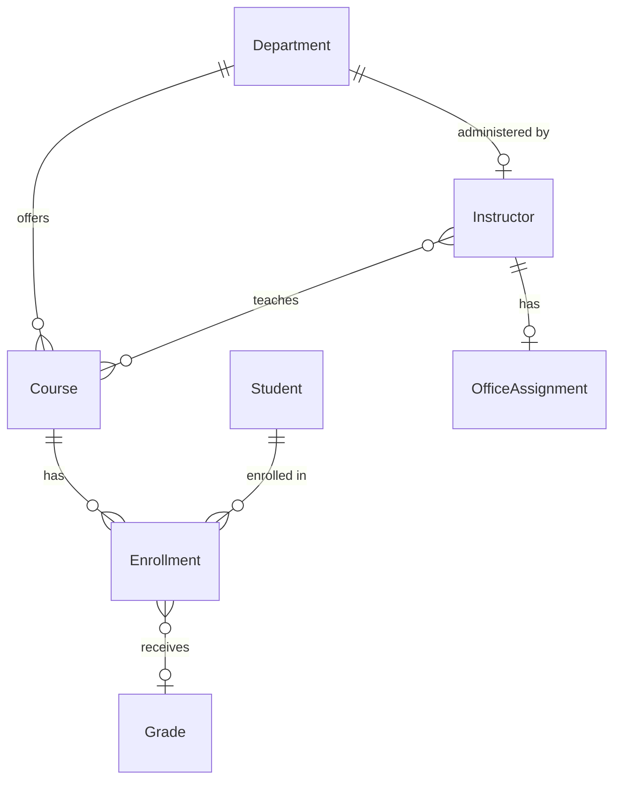

# Everything GitHub Copilot — Hands-On Lab

A comprehensive, hands-on lab teaching the **full GitHub Copilot agentic development experience** — agents, skills, instructions, prompts, hooks, MCP servers, orchestration, and GitHub Agentic Workflows — all while working on a real .NET application.

> **Start here** → [Lab Setup & Instructions](labs/setup.md)

---

## Prerequisites

| Requirement | Details |
|------------|---------|
| **GitHub account** | With Copilot license (Individual, Business, or Enterprise) |
| **VS Code** | Latest version with [GitHub Copilot](https://marketplace.visualstudio.com/items?itemName=GitHub.copilot) extension |
| **GitHub CLI** | [Install `gh`](https://cli.github.com/) — verify with `gh --version` |
| **Copilot CLI** | [Install guide](https://docs.github.com/en/copilot/how-tos/copilot-cli/set-up-copilot-cli/install-copilot-cli) — install with `npm install -g @github/copilot`, verify with `copilot --version` |
| **.NET 8 SDK** | [Download](https://dotnet.microsoft.com/download/dotnet/8.0) — verify with `dotnet --version` |
| **Git** | [Install](https://git-scm.com/downloads) — configured with your GitHub credentials |
| **gh-aw extension** | `gh extension install github/gh-aw` (for Labs 08–09) |

### Permissions & Licensing

Most labs (01–07, 10) work with **any Copilot license**. A few labs require specific plans or permissions:

| Lab | Feature | Required License | GitHub Permissions |
|-----|---------|-----------------|-------------------|
| **Lab 08** | GitHub Agentic Workflows (`gh-aw`) | Copilot Business or Enterprise | Actions enabled, `COPILOT_GITHUB_TOKEN` secret ([setup](labs/lab08.md#84-configure-the-copilot_github_token-secret)) |
| **Lab 09** | Copilot Coding Agent + Code Review | Copilot Pro+, Business, or Enterprise | Repo admin (to configure rulesets + enable coding agent) |
| All other labs | Agents, Skills, Instructions, Prompts, Hooks, MCP, Orchestration | Any Copilot license (Individual+) | Repo write access |

> **Note:** If your organization restricts Copilot features via policy, check with your admin that agent mode, MCP servers, and Copilot CLI are enabled.

---

## Quick Start

### 1. Fork & Clone

```bash
# Fork this repository on GitHub, then:
git clone https://github.com/YOUR-USERNAME/day-in-the-life-copilot-lab.git
cd day-in-the-life-copilot-lab
```

### 2. Build

```bash
dotnet build ContosoUniversity.sln
```

### 3. Run the Application

```bash
dotnet run --project ContosoUniversity.Web
```

The app starts at **https://localhost:52379** (or http://localhost:52380). On first run, the database is automatically created and seeded with sample data (students, courses, instructors, departments).

> **Note:** The Development configuration uses SQLite, which works on all platforms (Windows, macOS, Linux). The database file (`ContosoUniversity.db`) is created automatically in the web project directory. Production uses SQL Server.

Press `Ctrl+C` to stop the application.

### 4. Open in VS Code

```bash
code .
```

### 5. Verify

| Check | Command | Expected |
|-------|---------|----------|
| .NET build | `dotnet build ContosoUniversity.sln` | `Build succeeded` |
| Tests pass | `dotnet test ContosoUniversity.Tests` | All tests pass |
| Copilot CLI | `copilot --version` | Version number |
| Extensions | VS Code → Extensions panel | GitHub Copilot installed & signed in |

### 6. Start the labs

Open [`labs/setup.md`](labs/setup.md) and follow the instructions.

---

## The Application

**ContosoUniversity** is a brownfield .NET 8 web application with clean architecture. You'll use it throughout every lab to build, test, and orchestrate AI-powered development workflows.

```
ASP.NET MVC (Web)  →  EF Core (Infrastructure)  →  SQL Server / SQLite
```



| Project | Layer | Purpose |
|---------|-------|---------|
| **ContosoUniversity.Core** | Domain | Models, interfaces, business rules |
| **ContosoUniversity.Infrastructure** | Data | EF Core, repositories, services |
| **ContosoUniversity.Web** | Presentation | MVC controllers, views, DI |
| **ContosoUniversity.Tests** | Testing | xUnit + WebApplicationFactory |
| **ContosoUniversity.PlaywrightTests** | E2E | Browser-based Playwright tests |

---

## What You'll Learn

| Feature | What It Does | Lab |
|---------|-------------|-----|
| **Plugin Marketplace** | Browse and install community agents from the CLI marketplace | 01 |
| **Agents** | Custom `.agent.md` profiles with specialized AI roles | 01, 03 |
| **Skills** | `SKILL.md` auto-activating knowledge packs | 01, 04 |
| **Instructions** | `copilot-instructions.md` + path-scoped `.instructions.md` | 02 |
| **AGENTS.md** | Repository-level context — always loaded | 02 |
| **Prompts** | `.prompt.md` reusable command templates | 04 |
| **MCP Servers** | External tool integrations (Context7, Memory, Microsoft Learn) | 05 |
| **Hooks** | Pre/post tool-use lifecycle automation | 06 |
| **Orchestration** | Multi-agent coordination workflows | 07 |
| **Agentic Workflows** | `gh-aw` CI/CD automation with AI agents | 08, 09 |
| **Coding Agent** | Platform-level issue → PR implementation | 09 |
| **Code Review** | AI-powered pull request reviews | 09 |
| **Reindex** | Automatic semantic understanding of your codebase | 10 |
| **Session Management** | Memory MCP for decisions, handoffs, continuous learning | 10 |

---

## Lab Modules

> 💡 **Multi-Platform Support:** All lab command lines provide both **PowerShell** and **WSL/Bash** alternatives. Choose the commands that work best for your environment.

| Lab | Module | Focus |
|-----|--------|-------|
| [Setup](labs/setup.md) | Fork, Prerequisites, Overview | Fork repo, enable Actions, install tools |
| [Lab 01](labs/lab01.md) | Exploring Copilot Configuration | Plugin marketplace, agents, skills, instructions, prompts |
| [Lab 02](labs/lab02.md) | Custom Instructions & AGENTS.md | Instruction hierarchy, modify, extend |
| [Lab 03](labs/lab03.md) | Creating a .NET Agent | Build `dotnet-dev.agent.md` |
| [Lab 04](labs/lab04.md) | Skills & Prompts | Create a skill, write a prompt template |
| [Lab 05](labs/lab05.md) | MCP Server Configuration | Configure Context7, Memory, Sequential Thinking |
| [Lab 06](labs/lab06.md) | Hooks | Pre/post tool hooks, build checks |
| [Lab 07](labs/lab07.md) | Multi-Agent Orchestration | Orchestrator → dev → QA → review |
| [Lab 08](labs/lab08.md) | gh-aw: PRD Generation | Branch creation triggers PM agent |
| [Lab 09](labs/lab09.md) | Copilot Coding Agent & Code Review | Issue → Coding Agent → PR → AI review |
| [Lab 10](labs/lab10.md) | Reindex, Session Management & Memory | Reindex, Memory MCP, continuous learning, handoffs |

**Total: ~3 hours** (10 labs — self-paced or presenter-led)

---

## Pre-Configured Copilot Features

This repo ships with a rich set of configurations for you to explore and extend:

| Category | Count | Examples |
|----------|-------|---------|
| **Agents** | 2 (+ more you build!) | `planner`, `code-reviewer` — learners create more in Labs 03, 07 |
| **Skills** | 10 | `coding-standards`, `tdd-workflow`, `security-review`, `verification-loop`, `frontend-patterns` |
| **Prompts** | 21 | `/plan`, `/commit`, `/code-review`, `/tdd`, `/create-test`, `/handoff`, `/create-agent` |
| **Hooks** | 7 | Secret scanning, code formatting, type checking, continuous learning, error logging |
| **MCP Servers** | 5 | Context7 (library docs), Memory (knowledge graph), Sequential Thinking, WorkIQ, Microsoft Learn |
| **Instructions** | 3 | Path-specific rules for `.cs`, test files, and more |

---

## Testing

The project has two test suites covering unit, integration, and end-to-end scenarios.

### Unit & Integration Tests (xUnit)

Run all xUnit tests (unit + integration):

```bash
dotnet test ContosoUniversity.Tests --nologo
```

These tests use an **in-memory SQLite database** — no external dependencies required. The test infrastructure includes `CustomWebApplicationFactory` for integration tests and `TestDataSeeder` for deterministic test data.

**Filter by test category:**

| Category | Command |
|----------|---------|
| All xUnit tests | `dotnet test ContosoUniversity.Tests` |
| Student search query service | `dotnet test ContosoUniversity.Tests --filter "FullyQualifiedName~StudentQueryService"` |
| Student controller | `dotnet test ContosoUniversity.Tests --filter "FullyQualifiedName~StudentsController"` |
| Student integration | `dotnet test ContosoUniversity.Tests --filter "FullyQualifiedName~StudentIntegration"` |
| Specific test by name | `dotnet test ContosoUniversity.Tests --filter "FullyQualifiedName~TestName"` |

### End-to-End Tests (Playwright)

Playwright tests run against a **live instance** of the application. They are in a separate project and are **not included** in `ContosoUniversity.sln`, so `dotnet test ContosoUniversity.sln` will not run them.

**Step 1 — Start the application:**

```bash
dotnet run --project ContosoUniversity.Web
```

The app starts at **https://localhost:52379**.

**Step 2 — Install Playwright browsers** (first time only):

```bash
pwsh ContosoUniversity.PlaywrightTests/bin/Debug/net9.0/playwright.ps1 install
```

**Step 3 — Run E2E tests** (in a separate terminal):

```bash
dotnet test ContosoUniversity.PlaywrightTests --nologo
```

> **Note:** Playwright tests target `net9.0` and require the .NET 9 SDK. If you only have .NET 8 installed, the E2E tests will not build.

---

## Useful Commands

| Task | Command |
|------|---------|
| Build solution | `dotnet build ContosoUniversity.sln` |
| Run all unit/integration tests | `dotnet test ContosoUniversity.Tests` |
| Run E2E tests | `dotnet test ContosoUniversity.PlaywrightTests` (requires running app) |
| Run web app | `dotnet run --project ContosoUniversity.Web` |
| Run specific test | `dotnet test --filter "FullyQualifiedName~TestName"` |
| Check Copilot CLI | `copilot --version` |
| Install gh-aw | `gh extension install github/gh-aw` |

---

## Repository Structure

```
day-in-the-life-copilot-lab/
├── .github/
│   ├── agents/                    # 2 agent profiles — more created during labs
│   ├── skills/                    # 10 agent skills (SKILL.md)
│   ├── prompts/                   # 21 prompt templates (.prompt.md)
│   ├── hooks/                     # Hook configuration (default.json)
│   ├── instructions/              # 3 path-specific instructions (.instructions.md)
│   ├── copilot-instructions.md    # Repository-wide instructions
│   └── workflows/                 # GitHub Agentic Workflows (.md + .lock.yml)
├── .copilot/
│   └── mcp-config.json            # MCP server configuration (5 servers)
├── ContosoUniversity.sln          # .NET solution file
├── ContosoUniversity.Core/        # Domain models and interfaces
├── ContosoUniversity.Infrastructure/  # Data access and services
├── ContosoUniversity.Web/         # ASP.NET MVC web application
├── ContosoUniversity.Tests/       # xUnit unit and integration tests
├── ContosoUniversity.PlaywrightTests/ # Playwright E2E tests
├── labs/                          # Hands-on lab modules (10 labs)
├── solutions/                     # Reference solutions for each lab
├── docs/                          # Research and reference documentation
├── scripts/hooks/                 # Hook shell scripts (Bash + PowerShell)
├── mcp-configs/                   # MCP server reference configurations
├── AGENTS.md                      # Repository-level agent context
└── TROUBLESHOOTING.md             # Common issues and fixes
```

---

## GitHub Agentic Workflows

This lab uses [GitHub Agentic Workflows](https://github.com/github/gh-aw) (gh-aw) — author GitHub Actions using Markdown with YAML frontmatter. Two workflows are included:

| Workflow | Trigger | What It Does |
|----------|---------|-------------|
| **PRD Generation** | Feature branch created | PM agent generates a Product Requirements Document |
| **Code Review** | Pull request opened | Code review agent provides automated feedback |

---

## Workshop Content

| Resource | Description |
|----------|-------------|
| [Setup Guide](labs/setup.md) | Fork, prerequisites, environment setup |
| [Lab Modules](labs/) | 10 hands-on labs — start here |
| [Reference Solutions](solutions/) | Completed solutions for each lab |
| [Troubleshooting](TROUBLESHOOTING.md) | Common issues and fixes |
| [AGENTS.md](AGENTS.md) | Full project context document |

---

## Troubleshooting

| Problem | Fix |
|---------|-----|
| Copilot CLI not authenticated | Run `gh auth login` and follow prompts |
| MCP servers not loading | Copy `.copilot/mcp-config.json` to `~/.copilot/`, restart VS Code |
| `dotnet build` fails | Verify .NET 8 SDK: `dotnet --version` — [download](https://dotnet.microsoft.com/download/dotnet/8.0) |
| Skills not activating | Reference the skill explicitly in your prompt, or check `SKILL.md` frontmatter |
| Copilot not responding | Verify the extension is signed in and enabled in VS Code |

For the full troubleshooting guide, see [TROUBLESHOOTING.md](TROUBLESHOOTING.md).

---

## Contributing

See [CONTRIBUTING.md](CONTRIBUTING.md) for guidelines on adding agents, skills, prompts, and other configurations.

## License

[MIT](LICENSE)

---

*Built with GitHub Copilot.*
